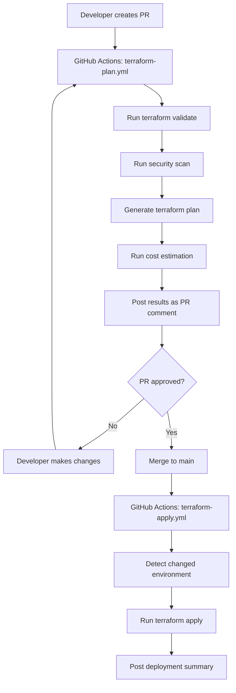

# CI/CD with GitHub Actions and Terraform

Demonstrates automated Terraform deployments using GitHub Actions with:
- Automated plan on pull requests
- Automated apply on merge to main
- Environment-based deployments
- Security scanning and validation
- Cost estimation with Infracost

## Directory Structure

```
ci-cd-github-actions/
├── README.md
├── .github/
│   └── workflows/
│       ├── terraform-plan.yml        # Run on PRs
│       ├── terraform-apply.yml       # Run on merge to main
│       ├── terraform-destroy.yml     # Manual cleanup
│       └── terraform-validate.yml    # Validation and security checks
├── terraform/
│   ├── dev/
│   │   ├── main.tf
│   │   ├── backend.tf
│   │   └── terraform.tfvars
│   ├── staging/
│   └── prod/
└── docs/
    └── workflow-guide.md
```

## Features

### 1. Automated Planning
- **Trigger**: Pull request opened/updated
- **Actions**:
  - Run `terraform init`
  - Run `terraform validate`
  - Run `terraform plan`
  - Post plan as PR comment
  - Run security scan (tfsec)
  - Estimate cost (Infracost)

### 2. Automated Deployment
- **Trigger**: Merge to main branch
- **Actions**:
  - Determine changed environment
  - Run `terraform apply` for that environment
  - Post deployment summary
  - Update deployment status

### 3. Security Scanning
- **Tools**:
  - tfsec: Security scanner
  - Checkov: Policy-as-code scanner
  - Terraform validate: Syntax validation
  - Trivy: Infrastructure scanner

### 4. Cost Estimation
- **Infracost**: Estimates AWS costs for changes
- Shows cost diff on PRs
- Helps prevent surprise bills

## Prerequisites

1. **GitHub Repository** with Terraform code
2. **AWS Credentials** stored as GitHub secrets
3. **GitHub Actions enabled**
4. **Optional**: Infracost API key

## Setup

### 1. Configure GitHub Secrets

Go to repository Settings → Secrets and variables → Actions

Add these secrets:
- `AWS_ACCESS_KEY_ID`: AWS access key
- `AWS_SECRET_ACCESS_KEY`: AWS secret key
- `AWS_REGION`: AWS region (e.g., us-west-2)
- `INFRACOST_API_KEY`: (Optional) Infracost API key

### 2. Add Workflows

Copy the workflow files from `.github/workflows/` to your repository.

### 3. Configure Backend

Ensure `backend.tf` uses S3:
```hcl
terraform {
  backend "s3" {
    bucket = "my-terraform-state"
    key    = "env/terraform.tfstate"
    region = "us-west-2"
  }
}
```

### 4. Test the Workflow

```bash
# Create a feature branch
git checkout -b feature/test-ci

# Make changes to Terraform code
vi terraform/dev/main.tf

# Commit and push
git add .
git commit -m "test: verify CI/CD pipeline"
git push origin feature/test-ci

# Open pull request on GitHub
# GitHub Actions will automatically run terraform plan
```

## Workflows

### terraform-plan.yml

Runs on every pull request:
1. Checkout code
2. Configure AWS credentials
3. Initialize Terraform
4. Validate Terraform
5. Run security scan (tfsec)
6. Generate plan
7. Estimate cost (Infracost)
8. Post results as PR comment

### terraform-apply.yml

Runs when PR is merged to main:
1. Detect which environment changed
2. Initialize Terraform for that environment
3. Apply changes automatically
4. Post deployment summary

### terraform-validate.yml

Runs on every push:
1. Format check (`terraform fmt -check`)
2. Validation check
3. Security scan
4. Documentation check

### terraform-destroy.yml

Manual workflow (workflow_dispatch):
1. Select environment
2. Confirm destruction
3. Run `terraform destroy`

## Environment Strategy

### Development
- **Auto-deploy**: Yes, on merge to `main`
- **Approval**: Not required
- **Branch**: `main`

### Staging
- **Auto-deploy**: Yes, on merge to `main`
- **Approval**: Optional (can add)
- **Branch**: `main`

### Production
- **Auto-deploy**: No
- **Approval**: Required (GitHub Environments)
- **Branch**: `release/*` or manual trigger

## GitHub Environments Setup

### 1. Create Environments

Go to Settings → Environments → New environment

Create:
- `development`
- `staging`
- `production`

### 2. Configure Protection Rules

For **production** environment:
- ✅ Required reviewers (2 approvers)
- ✅ Wait timer (5 minutes)
- ✅ Deployment branches (only `main` or `release/*`)

### 3. Environment Secrets

Add environment-specific secrets:
- `TF_VAR_cluster_name`
- `TF_VAR_image_tag`
- Any sensitive variables

## PR Workflow Example



## Security Best Practices

### 1. Never Commit Secrets
- Use GitHub Secrets
- Use AWS Secrets Manager
- Use environment variables

### 2. Require Reviews
- Protect `main` branch
- Require at least 1 approval for dev/staging
- Require 2+ approvals for production

### 3. Use OIDC (Recommended)

Instead of long-lived AWS credentials, use OpenID Connect:

```yaml
- name: Configure AWS Credentials
  uses: aws-actions/configure-aws-credentials@v4
  with:
    role-to-assume: arn:aws:iam::123456789012:role/GitHubActionsRole
    aws-region: us-west-2
```

Benefits:
- No long-lived credentials
- Automatic credential rotation
- Scoped permissions per repository

### 4. Scan for Vulnerabilities

```yaml
- name: Run tfsec
  uses: aquasecurity/tfsec-action@v1.0.0

- name: Run Checkov
  uses: bridgecrewio/checkov-action@master
```

## Cost Optimization

### Infracost Integration

```yaml
- name: Setup Infracost
  uses: infracost/actions/setup@v2
  with:
    api-key: ${{ secrets.INFRACOST_API_KEY }}

- name: Generate cost estimate
  run: |
    infracost breakdown --path=. --format=json --out-file=/tmp/infracost.json
    infracost comment github --path=/tmp/infracost.json ...
```

Shows cost changes on PRs:
```
📊 Infracost estimate: Monthly cost will increase by $42 (+8%)

+ aws_instance.app
  +$36 (new resource)

+ aws_lb.app
  +$18 (new resource)

- aws_instance.old
  -$12 (deleted)
```

## Rollback Strategy

### Option 1: Revert Git Commit

```bash
# Revert the merge commit
git revert -m 1 <merge-commit-hash>
git push origin main

# CI/CD will automatically apply the revert
```

### Option 2: Manual Destroy

Use the `terraform-destroy.yml` workflow:
1. Go to Actions tab
2. Select "Terraform Destroy"
3. Click "Run workflow"
4. Select environment
5. Confirm

### Option 3: Terraform State Rollback

```bash
# Pull current state
terraform state pull > backup.tfstate

# Rollback to previous version (S3 versioning)
aws s3api list-object-versions \
  --bucket my-terraform-state \
  --prefix env/terraform.tfstate

# Restore specific version
aws s3api get-object \
  --bucket my-terraform-state \
  --key env/terraform.tfstate \
  --version-id <version-id> \
  restored.tfstate

# Push restored state
terraform state push restored.tfstate
```

## Troubleshooting

### Plan Fails in CI

Check:
- AWS credentials are correct
- Backend bucket exists
- Terraform version matches local

### Apply Hangs

Common causes:
- Resource quota exceeded
- IAM permissions missing
- Dependency deadlock

Solution: Add timeout
```yaml
- name: Terraform Apply
  run: terraform apply -auto-approve
  timeout-minutes: 30
```

### State Lock Errors

```bash
# Force unlock (use carefully!)
terraform force-unlock <lock-id>
```

### Cost Estimate Missing

- Verify Infracost API key is set
- Check Infracost configuration file
- Ensure supported cloud provider

## Advanced Patterns

### Matrix Builds

Test multiple Terraform versions:
```yaml
strategy:
  matrix:
    terraform-version: [1.5.0, 1.6.0, latest]
```

### Parallel Environments

Deploy dev and staging in parallel:
```yaml
jobs:
  deploy-dev:
    # ...
  deploy-staging:
    # ...
  deploy-prod:
    needs: [deploy-dev, deploy-staging]
    # Only runs after dev and staging succeed
```

### Notification Integration

```yaml
- name: Notify Slack
  uses: slackapi/slack-github-action@v1
  with:
    payload: |
      {
        "text": "Deployment to ${{ env.ENVIRONMENT }} completed"
      }
```

## Cost Estimate

### GitHub Actions Minutes

- **Free tier**: 2,000 minutes/month
- **Typical pipeline**: 5-10 minutes per run
- **Estimated runs**: 40-80 per month
- **Cost**: Free for most teams

### Additional Tools

- **Infracost**: Free for public repos, $50/month for private
- **tfsec**: Free
- **Checkov**: Free

## References

- [GitHub Actions Documentation](https://docs.github.com/en/actions)
- [terraform-github-actions](https://github.com/hashicorp/terraform-github-actions)
- [Infracost](https://www.infracost.io/)
- [tfsec](https://github.com/aquasecurity/tfsec)
- [AWS OIDC with GitHub Actions](https://docs.github.com/en/actions/deployment/security-hardening-your-deployments/configuring-openid-connect-in-amazon-web-services)
